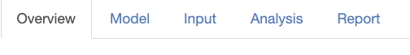

## Overview

Here is an overview 

[Here is a complete description](google.com) of the ATMP app. At the top of the screen there are five tabs as illustrated in the figure below.

{width="50%"}

1. _Overview_ - The current tab
1. _Model_ - Select health model
1. _Input_ - See/modify the input values of the model
1. _Analysis_ - Analysis of the health model
1. _Report_ - Download a report of the analysis