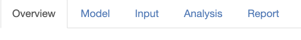

## Overview

Here is an overview

[Here is a complete description](google.com) of the ATMP app. At the top
of the screen there are five tabs as illustrated in the figure below.

1.  *Overview* - The current tab
2.  *Model* - Select health model
3.  *Input* - See/modify the input values of the model
4.  *Analysis* - Analysis of the health model
5.  *Report* - Download a report of the analysis
