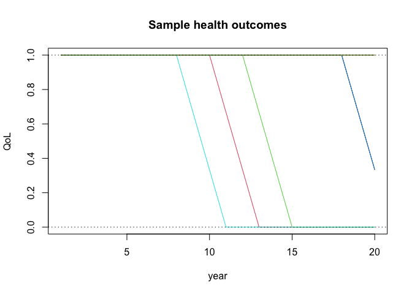
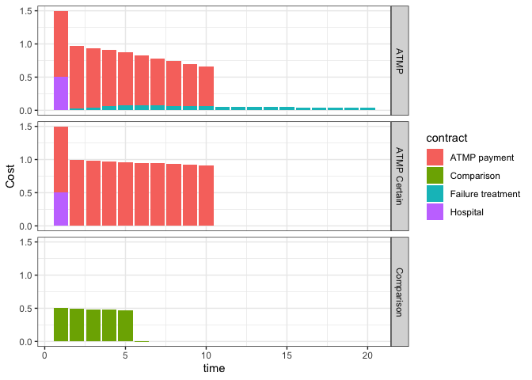
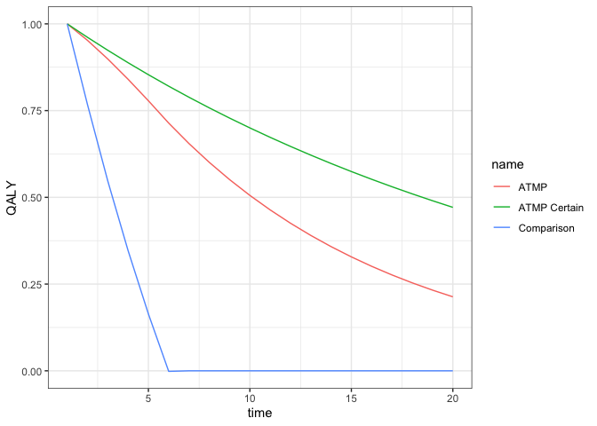
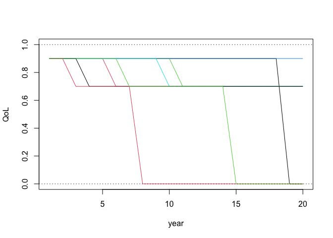
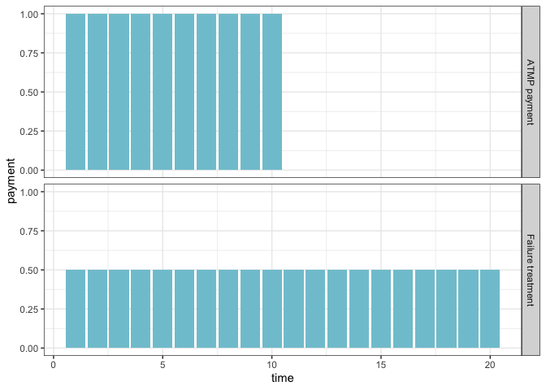

# Introduction

The ATMP package is an R package to analyse the long term health effects
and costs of ATMP treatments. The package focuses on the analysis of
different payment schemes that condition on outcomes over time.
Modelling payments over a long time horizon, the package allows payment
schemes that specify payments or reimbursements that can depend on
individual or aggregate outcomes.

The current version simulates the expected health and cost effects given
the parameters used. Modelling the variability outcomes in terms of
individual outcomes, or uncertainty in the parameter estimates increases
the level of complexity of the interface. Given the uncertainties in
long term estimation, we have chosen to focus on allowing variation in
parameter estimates rather than specifying a distribution for the
uncertain parameters.

Two guiding principles in the design of the package are flexibility and
ease of use. Flexibility is crucial as both ATMP treatments and payment
models can be diverse, and the modelling of new treatments cannot be
completely foreseen at the present time. The package allows for simple
analysis for users less experienced in R programming as well as
customisation of analysis for users that are more familiar with R and
Rmarkdown.

# Structure of a simulation

A simulation is based on a combination of *treatments* and *payment
schemes*, combined with a set of *global parameters* such as discount
factors, time horizon etc.

*Treatments* specify Markov health models, with states, transitions
between states and the quality of life of each state. The ATMP package
restricts the structure of the health model in order for it to be easier
to use. In this first version transitions are all in one direction - the
health state never improves. Although the underlying functionality is
general allowing arbitrary transitions between health states - such
generality is more difficult to specify in a simple way for users.

*Payment schemes* specify payment schemes, how much is payed when under
what conditions. A treatment can include several payment schemes, with
multiple payments. Payment scheme payments can begin and end depending
on health states. For example if a treatment stops working, payment for
an alternative treatment begins.

Payment schemes and treatments are associated by a *Arm*. An arm is
simply a number, with each payment scheme and treatment having the same
number being associated.

-   Many payment schemes can be associated with an arm, for different
    payments of different treatments in the treatment process

-   Many treatments can be included in an arm, to analyse the health
    outcome under varying treatment assumptions

## Model specification

Inputs to the simulation are set in an Excel file. Each health case has
an Excel file specifying health and payment parameters for the models
used. Although all parameters are set in the Excel sheet, one can also
allow modification of parameters interactively using Shiny controls.
Although many parameters can be set in the Excel tables, only the
parameters of interest have to be included in the tables. With sensible
default values for parameters, those that are not central do not have to
be included.

# A simple example

Below is a minimal treatment table for two health models *ATMP* and
*Comparison*, each with 6 states. The only difference between the
treatments is the column `p_HU` - the probability of moving from state 1
to 2. For simplicity, let’s assume that the probability of dying from
other reasons is zero. As QoL has not specified otherwise, state 1 is
full health with QoL = 1 and the final state 6 is death with QoL = 0.
For the `Comparison` the probability of transitioning to state 2 is 1.

<table data-quarto-disable-processing='true' class='cl-20bbbb7e'><thead><tr style="overflow-wrap:break-word;"><th class="cl-20b9c454">
Plan
</th><th class="cl-20b9c455">
Treatment
</th><th class="cl-20b9c456">
Failure hazard
</th><th class="cl-20b9c45e">
Health states
</th></tr></thead><tbody><tr style="overflow-wrap:break-word;"><td class="cl-20b9c45f">
1
</td><td class="cl-20b9c460">
ATMP
</td><td class="cl-20b9c461">
0.05
</td><td class="cl-20b9c468">
6
</td></tr><tr style="overflow-wrap:break-word;"><td class="cl-20b9c469">
0
</td><td class="cl-20b9c46a">
Comparison
</td><td class="cl-20b9c46b">
1.00
</td><td class="cl-20b9c46c">
6
</td></tr></tbody></table>

The probabilities can be interpreted as follows. Consider the resultant
table below for the *ATMP* treatment. The hazard p\_HU is the
probability of moving from state 1 to 2. The probabilities p\_HD and
p\_UD that a healthy or an unhealthy person dies without full
progression (moving directly to state 6) are here set to zero. If not
specified the default values for parameters are used.

For ATMP, the transition from full health (state 1) to progression
(state 2) is random, with a probability of 0.05 of moving to state 2.
Progression once started is deterministic, with probability 1 of moving
to the next state, eventually ending in death (state 6).

<table data-quarto-disable-processing='true' class='cl-20d4ecfc'><thead><tr style="overflow-wrap:break-word;"><th class="cl-20d35018">
state
</th><th class="cl-20d35019">
pr.prog
</th><th class="cl-20d35022">
QoL
</th></tr></thead><tbody><tr style="overflow-wrap:break-word;"><td class="cl-20d35023">
1
</td><td class="cl-20d35024">
0.05
</td><td class="cl-20d3502c">
1.00
</td></tr><tr style="overflow-wrap:break-word;"><td class="cl-20d3502d">
2
</td><td class="cl-20d3502e">
1.00
</td><td class="cl-20d3502f">
0.80
</td></tr><tr style="overflow-wrap:break-word;"><td class="cl-20d35036">
3
</td><td class="cl-20d35037">
1.00
</td><td class="cl-20d35038">
0.60
</td></tr><tr style="overflow-wrap:break-word;"><td class="cl-20d35040">
4
</td><td class="cl-20d35041">
1.00
</td><td class="cl-20d3504a">
0.40
</td></tr><tr style="overflow-wrap:break-word;"><td class="cl-20d3504b">
5
</td><td class="cl-20d35054">
1.00
</td><td class="cl-20d35055">
0.20
</td></tr><tr style="overflow-wrap:break-word;"><td class="cl-20d3502d">
6
</td><td class="cl-20d3502e">
0.00
</td><td class="cl-20d3502f">
0.00
</td></tr></tbody></table>

Treatment tables can include more detailed information. At this time the
following variables can be specified in a treatment table. If not
specified, the default values in the table below are used (given by the
`value` column). For example the random state does not have to be the
first state - we can have delayed treatment where there is progression
prior to treatment.

<table data-quarto-disable-processing='true' class='cl-20e002e0'><thead><tr style="overflow-wrap:break-word;"><th class="cl-20de3064">
title
</th><th class="cl-20de3065">
value
</th><th class="cl-20de306e">
description
</th></tr></thead><tbody><tr style="overflow-wrap:break-word;"><td class="cl-20de306f">
Plan
</td><td class="cl-20de3070">
 
</td><td class="cl-20de3071">
Plan number combining Treatment and Contract
</td></tr><tr style="overflow-wrap:break-word;"><td class="cl-20de3078">
Treatment
</td><td class="cl-20de3079">
 
</td><td class="cl-20de307a">
Treatment name
</td></tr><tr style="overflow-wrap:break-word;"><td class="cl-20de3082">
Failure hazard
</td><td class="cl-20de3083">
0.00
</td><td class="cl-20de308c">
Probability of progression starting
</td></tr><tr style="overflow-wrap:break-word;"><td class="cl-20de308d">
Death
</td><td class="cl-20de308e">
0.00
</td><td class="cl-20de3096">
Probability of dying with full health
</td></tr><tr style="overflow-wrap:break-word;"><td class="cl-20de3082">
Death in prog.
</td><td class="cl-20de3083">
0.00
</td><td class="cl-20de308c">
Probability of dying in progression state
</td></tr><tr style="overflow-wrap:break-word;"><td class="cl-20de3097">
Health states
</td><td class="cl-20de3098">
0.00
</td><td class="cl-20de30a0">
Number of health states
</td></tr><tr style="overflow-wrap:break-word;"><td class="cl-20de306f">
QoL Column
</td><td class="cl-20de3070">
 
</td><td class="cl-20de3071">
Name of column in QoL table (non-linear progression)
</td></tr><tr style="overflow-wrap:break-word;"><td class="cl-20de30a1">
QoL Start
</td><td class="cl-20de30a2">
1.00
</td><td class="cl-20de30aa">
Initial QoL
</td></tr><tr style="overflow-wrap:break-word;"><td class="cl-20de30ab">
QoL End
</td><td class="cl-20de30ac">
0.00
</td><td class="cl-20de30ad">
Final QoL
</td></tr><tr style="overflow-wrap:break-word;"><td class="cl-20de308d">
Random state
</td><td class="cl-20de308e">
1.00
</td><td class="cl-20de3096">
Which state is the random state. To model progression before treatment
</td></tr></tbody></table>

## Treatment plan

Treatments and payment schemes are matched by specifying the same *Arm*.
In our example, we want to compare the ATMP treatment (arm 1) with a
comparison alternative (arm 2). Payment schemes, discussed below, with
the same plan numbers will be matched.

## Transition matrix

From the treatment table a transition matrix is generated. For the
example ATMP treatment, it is given by the table below. The table
describes the probability of moving from one state (rows in the table)
to a new state in the next period (columns in the table). In the ATMP
treatment it is a combination of random start of progression and
deterministic progression over 4 years.

<table data-quarto-disable-processing='true' class='cl-20ed9cca'><thead><tr style="overflow-wrap:break-word;"><th class="cl-20ebe5ba">

</th><th class="cl-20ebe5bb">
PF
</th><th class="cl-20ebe5bb">
P1
</th><th class="cl-20ebe5bb">
P2
</th><th class="cl-20ebe5bb">
P3
</th><th class="cl-20ebe5bb">
P4
</th><th class="cl-20ebe5bb">
D
</th></tr></thead><tbody><tr style="overflow-wrap:break-word;"><td class="cl-20ebe5bc">
PF
</td><td class="cl-20ebe5c4">
0.94
</td><td class="cl-20ebe5c4">
0.05
</td><td class="cl-20ebe5c4">
0.00
</td><td class="cl-20ebe5c4">
0.00
</td><td class="cl-20ebe5c4">
0.00
</td><td class="cl-20ebe5c4">
0.01
</td></tr><tr style="overflow-wrap:break-word;"><td class="cl-20ebe5ba">
P1
</td><td class="cl-20ebe5bb">
0.00
</td><td class="cl-20ebe5bb">
0.00
</td><td class="cl-20ebe5bb">
0.99
</td><td class="cl-20ebe5bb">
0.00
</td><td class="cl-20ebe5bb">
0.00
</td><td class="cl-20ebe5bb">
0.01
</td></tr><tr style="overflow-wrap:break-word;"><td class="cl-20ebe5ba">
P2
</td><td class="cl-20ebe5bb">
0.00
</td><td class="cl-20ebe5bb">
0.00
</td><td class="cl-20ebe5bb">
0.00
</td><td class="cl-20ebe5bb">
0.99
</td><td class="cl-20ebe5bb">
0.00
</td><td class="cl-20ebe5bb">
0.01
</td></tr><tr style="overflow-wrap:break-word;"><td class="cl-20ebe5ba">
P3
</td><td class="cl-20ebe5bb">
0.00
</td><td class="cl-20ebe5bb">
0.00
</td><td class="cl-20ebe5bb">
0.00
</td><td class="cl-20ebe5bb">
0.00
</td><td class="cl-20ebe5bb">
0.99
</td><td class="cl-20ebe5bb">
0.01
</td></tr><tr style="overflow-wrap:break-word;"><td class="cl-20ebe5ba">
P4
</td><td class="cl-20ebe5bb">
0.00
</td><td class="cl-20ebe5bb">
0.00
</td><td class="cl-20ebe5bb">
0.00
</td><td class="cl-20ebe5bb">
0.00
</td><td class="cl-20ebe5bb">
0.00
</td><td class="cl-20ebe5bb">
1.00
</td></tr><tr style="overflow-wrap:break-word;"><td class="cl-20ebe5ba">
D
</td><td class="cl-20ebe5bb">
0.00
</td><td class="cl-20ebe5bb">
0.00
</td><td class="cl-20ebe5bb">
0.00
</td><td class="cl-20ebe5bb">
0.00
</td><td class="cl-20ebe5bb">
0.00
</td><td class="cl-20ebe5bb">
1.00
</td></tr></tbody></table>

## Quality of life

To each state, a measure of the quality of life (QoL) is associated. By
default in the ATMP treatment a linear decrease in QoL from 1 (full
health) to 0 (death) over the 6 states.

The figure below shows a simulation of 8 individuals, with both 4 year
progression and immediate transition to death. Four individuals progress
from full health, and one individual dies without progression.

# Payment schemes

Payment schemes are specified in a table in the Excel input sheet. A
simple example from above, we let each treatment have a corresponding
payment scheme specifying a payment plan.

<table data-quarto-disable-processing='true' class='cl-2101e8ba'><thead><tr style="overflow-wrap:break-word;"><th class="cl-21004c12">
Plan
</th><th class="cl-21004c13">
Contract
</th><th class="cl-21004c1c">
Tot.Payment
</th><th class="cl-21004c1d">
Cont. payment
</th><th class="cl-21004c1e">
Periods
</th><th class="cl-21004c1f">
End
</th></tr></thead><tbody><tr style="overflow-wrap:break-word;"><td class="cl-21004c26">
1
</td><td class="cl-21004c27">
ATMP payment
</td><td class="cl-21004c28">
10.00
</td><td class="cl-21004c29">
0.00
</td><td class="cl-21004c2a">
10
</td><td class="cl-21004c30">
2
</td></tr><tr style="overflow-wrap:break-word;"><td class="cl-21004c31">
0
</td><td class="cl-21004c32">
Comparison
</td><td class="cl-21004c33">
0.00
</td><td class="cl-21004c3a">
0.50
</td><td class="cl-21004c3b">
0
</td><td class="cl-21004c3c">
6
</td></tr></tbody></table>

The total *ATMP payment* is 10 with a payment scheme length of 10. This
implies that the payment is spread evenly over the ten years, with a
payment of 1 each year. The payment scheme also specifies that if the
end state (here state 2) is reached, payments cease.

For the *Comparison* alternative we assume continuous purchases as long
as the patient is alive. Payments are made as long as state 6 (death) is
not reached. Payments of 0.5 have been specified as continuous payments,
implying that this is the yearly payment. The payment scheme length has
no effect in this case, here set to 0.

The payment plans for *ATMP payment* and *Comparison* over a 20 year
time horizon are shown below.

## Structure of Payment schemes

A full list of specifications is given in the table below.

<table data-quarto-disable-processing='true' class='cl-212f7b0e'><thead><tr style="overflow-wrap:break-word;"><th class="cl-212d598c">
title
</th><th class="cl-212d598d">
value
</th><th class="cl-212d5996">
description
</th></tr></thead><tbody><tr style="overflow-wrap:break-word;"><td class="cl-212d5997">
Plan
</td><td class="cl-212d5998">
 
</td><td class="cl-212d59a0">
Plan number combining Treatment and Contract
</td></tr><tr style="overflow-wrap:break-word;"><td class="cl-212d59a1">
Contract
</td><td class="cl-212d59a2">
 
</td><td class="cl-212d59aa">
Contract name
</td></tr><tr style="overflow-wrap:break-word;"><td class="cl-212d59ab">
Tot.Payment
</td><td class="cl-212d59ac">
0.00
</td><td class="cl-212d59ad">
Total payment or yearly paymentif payment is continuous
</td></tr><tr style="overflow-wrap:break-word;"><td class="cl-212d59b4">
Cont. payment
</td><td class="cl-212d59b5">
0.00
</td><td class="cl-212d59b6">
Payment each year that the patient is alive (traditional)
</td></tr><tr style="overflow-wrap:break-word;"><td class="cl-212d59be">
Cost Trend
</td><td class="cl-212d59bf">
0.00
</td><td class="cl-212d59c0">
Cost trend over time, for continuous payment
</td></tr><tr style="overflow-wrap:break-word;"><td class="cl-212d59c8">
Periods
</td><td class="cl-212d59c9">
20.00
</td><td class="cl-212d59ca">
Total length of contract
</td></tr><tr style="overflow-wrap:break-word;"><td class="cl-212d59be">
Payment
</td><td class="cl-212d59bf">
0.00
</td><td class="cl-212d59c0">
Share of payment in initial period
</td></tr><tr style="overflow-wrap:break-word;"><td class="cl-212d59d2">
Refund
</td><td class="cl-212d59d3">
0.00
</td><td class="cl-212d59d4">
Share of payments refunded upon failure (progression)
</td></tr><tr style="overflow-wrap:break-word;"><td class="cl-212d5997">
Start
</td><td class="cl-212d5998">
1.00
</td><td class="cl-212d59a0">
State where contract begins (ex: additional treatment in progression)
</td></tr><tr style="overflow-wrap:break-word;"><td class="cl-212d59dc">
End
</td><td class="cl-212d59dd">
2.00
</td><td class="cl-212d59de">
State where contract ends
</td></tr><tr style="overflow-wrap:break-word;"><td class="cl-212d59e6">
Agg.Fail
</td><td class="cl-212d59e7">
0.00
</td><td class="cl-212d59e8">
Threshold share of population for aggregate failure
</td></tr></tbody></table>

Payment schemes specify:

1.  Payments over time such as payment length, share of payments as
    initial payment.

2.  Conditions for payments ending can be specified in different ways

-   Individual payments cease if a health state is reach, such as
    progression starting and/or at death

-   Payments for all treated can cease if the aggregate failure of the
    treatment is above a specified threshold

-   Cessation of payments can also include a refund, specified as a
    share of payments.

1.  The state where payments start can be specified

-   Ex. If ATMP stops working, the cost of an alternative treatment can
    be included.

## Global variables

In addition to specifying treatments and payment schemes, *global
variables* are also specified in a table. All parameters common to all
treatments and payment schemes in the case are specified in the global
table. The time horizon of analysis, here 20 years, and discount rate
are such common parameters.

<table data-quarto-disable-processing='true' class='cl-2138f6d4'><thead><tr style="overflow-wrap:break-word;"><th class="cl-21376526">
name
</th><th class="cl-21376530">
value
</th></tr></thead><tbody><tr style="overflow-wrap:break-word;"><td class="cl-21376531">
hazard
</td><td class="cl-21376532">
0.04
</td></tr><tr style="overflow-wrap:break-word;"><td class="cl-2137653a">
discount
</td><td class="cl-2137653b">
0.03
</td></tr><tr style="overflow-wrap:break-word;"><td class="cl-2137653c">
firm_discount
</td><td class="cl-2137653d">
0.03
</td></tr><tr style="overflow-wrap:break-word;"><td class="cl-2137653a">
threshold
</td><td class="cl-2137653b">
1.00
</td></tr><tr style="overflow-wrap:break-word;"><td class="cl-21376544">
time_horizon
</td><td class="cl-21376545">
20.00
</td></tr><tr style="overflow-wrap:break-word;"><td class="cl-21376546">
active_plan
</td><td class="cl-21376547">
1.00
</td></tr><tr style="overflow-wrap:break-word;"><td class="cl-2137654e">
control_plan
</td><td class="cl-2137654f">
0.00
</td></tr></tbody></table>

# Analysis

Analysis of health effects and costs can be done either by simply
processing the input data specified in the Excel file, or interactively
in a Shiny app.

The results of the analysis can be

1.  Shown on screen

2.  Generated as a report in a chosen format: HTML/Word/Pdf/Powerpoint.

3.  As Excel tables, for further analysis

Interactive analysis allows modification of all input specified in Excel
sheet. This allows interactive change of important parameters such as
payment scheme length or ATMP hazard. The modified model can be saved to
an excel file.

As even simple health models require a lot of indata, interactivity is
based on setting all values of interest in an Excel sheet. A starting
point for a model can be one of the example models provided with the
app. The Excel sheet specifies all indata, with the user only modifying
selected variables. The choice of variables for interactive analysis
will depend on the specific model at hand.

# Analysis of payment schemes

Here we will study an example with more complicated treatment and
payment structure than above. We will compare two ATMP treatments with a
Comparison alternative. Under the *ATMP Certain* treatment it is assumed
that the ATMP treatment will not fail; the probability p\_HU = 0. The
*ATMP* treatment differs only in that the probability of failure, with
transition to progression occurs with probability 0.05. Progression is
as before over four states (years), ending in death.

<table data-quarto-disable-processing='true' class='cl-214774f2'><thead><tr style="overflow-wrap:break-word;"><th class="cl-21459ea2">
Plan
</th><th class="cl-21459eac">
Treatment
</th><th class="cl-21459ead">
Failure hazard
</th><th class="cl-21459eb6">
Death
</th><th class="cl-21459eb7">
Death in prog.
</th><th class="cl-21459ec0">
Health states
</th></tr></thead><tbody><tr style="overflow-wrap:break-word;"><td class="cl-21459ec1">
1
</td><td class="cl-21459ec2">
ATMP
</td><td class="cl-21459eca">
0.05
</td><td class="cl-21459ecb">
0.01
</td><td class="cl-21459ecc">
0.02
</td><td class="cl-21459ed4">
6
</td></tr><tr style="overflow-wrap:break-word;"><td class="cl-21459ed5">
1
</td><td class="cl-21459ed6">
ATMP Certain
</td><td class="cl-21459ed7">
0.00
</td><td class="cl-21459ede">
0.01
</td><td class="cl-21459edf">
0.02
</td><td class="cl-21459ee0">
6
</td></tr><tr style="overflow-wrap:break-word;"><td class="cl-21459ee8">
0
</td><td class="cl-21459ee9">
Comparison
</td><td class="cl-21459eea">
1.00
</td><td class="cl-21459eeb">
0.01
</td><td class="cl-21459ef2">
0.02
</td><td class="cl-21459ef3">
6
</td></tr></tbody></table>

Plan 1 has a payment for the ATMP treatment, and separately internal
costs. If the ATMP treatment fails, there is a cost of using the
comparison treatment in the progression period. The *Progression
treatment* starts in state 2 and ends with death (state 6).

<table data-quarto-disable-processing='true' class='cl-2156daa0'><thead><tr style="overflow-wrap:break-word;"><th class="cl-2155338a">
plan
</th><th class="cl-21553394">
name
</th><th class="cl-2155339e">
tot_payment
</th><th class="cl-2155339f">
cont_payment
</th><th class="cl-215533a0">
contract_length
</th><th class="cl-215533a8">
start
</th><th class="cl-215533a9">
end
</th><th class="cl-215533aa">
cost_trend
</th></tr></thead><tbody><tr style="overflow-wrap:break-word;"><td class="cl-215533b2">
1
</td><td class="cl-215533b3">
ATMP payment
</td><td class="cl-215533b4">
10.00
</td><td class="cl-215533bc">
0.00
</td><td class="cl-215533bd">
10
</td><td class="cl-215533be">
1
</td><td class="cl-215533bf">
2
</td><td class="cl-215533c6">
0.00
</td></tr><tr style="overflow-wrap:break-word;"><td class="cl-215533c7">
1
</td><td class="cl-215533c8">
Hospital
</td><td class="cl-215533d0">
0.50
</td><td class="cl-215533d1">
0.00
</td><td class="cl-215533d2">
1
</td><td class="cl-215533da">
1
</td><td class="cl-215533db">
6
</td><td class="cl-215533dc">
0.00
</td></tr><tr style="overflow-wrap:break-word;"><td class="cl-215533e4">
1
</td><td class="cl-215533e5">
Failure treatment
</td><td class="cl-215533ee">
0.00
</td><td class="cl-215533ef">
0.50
</td><td class="cl-215533f0">
0
</td><td class="cl-215533f8">
2
</td><td class="cl-215533f9">
6
</td><td class="cl-215533fa">
0.00
</td></tr></tbody></table>

-   Analysis of three different payment plans

1.  ATMP with continuous payment over 10 years and an initial hospital
    cost of 0.5. Health costs in addition to the payment of the ATMP
    treatment can be specified independently.

2.  ATMP as in the previous plan with zero hazard of ATMP leading to
    progression. This allows the comparison of the health effects if
    there is no uncertainty in the long term health effects of ATMP with
    the effects if there is a positive hazard that the health effect
    disappears.

3.  Comparison treatment

The main function `contract_analysis()` generates a data.frame of QALYs
for each treatment and Costs for each payment scheme associated with the
treatment.

    df =  contract_analysis(indata, show_details = TRUE) 

The content of `df` is as follows

<table data-quarto-disable-processing='true' class='cl-216eda1a'><thead><tr style="overflow-wrap:break-word;"><th class="cl-2169ee60">
name
</th><th class="cl-2169ee6a">
plan
</th><th class="cl-2169ee6b">
contract
</th><th class="cl-2169ee6c">
QALY
</th><th class="cl-2169ee74">
Cost
</th></tr></thead><tbody><tr style="overflow-wrap:break-word;"><td class="cl-2169ee75">
ATMP
</td><td class="cl-2169ee76">
1.00
</td><td class="cl-2169ee77">
ATMP payment
</td><td class="cl-2169ee7e">
10.74
</td><td class="cl-2169ee7f">
7.85
</td></tr><tr style="overflow-wrap:break-word;"><td class="cl-2169ee88">
ATMP
</td><td class="cl-2169ee89">
1.00
</td><td class="cl-2169ee8a">
Hospital
</td><td class="cl-2169ee92">
 
</td><td class="cl-2169ee93">
0.50
</td></tr><tr style="overflow-wrap:break-word;"><td class="cl-2169ee94">
ATMP
</td><td class="cl-2169ee95">
1.00
</td><td class="cl-2169ee9c">
Failure treatment
</td><td class="cl-2169ee9d">
 
</td><td class="cl-2169ee9e">
1.00
</td></tr><tr style="overflow-wrap:break-word;"><td class="cl-2169ee9f">
ATMP Certain
</td><td class="cl-2169eea6">
1.00
</td><td class="cl-2169eea7">
ATMP payment
</td><td class="cl-2169eea8">
14.09
</td><td class="cl-2169eea9">
9.56
</td></tr><tr style="overflow-wrap:break-word;"><td class="cl-2169eeaa">
ATMP Certain
</td><td class="cl-2169eeb0">
1.00
</td><td class="cl-2169eeb1">
Hospital
</td><td class="cl-2169eeb2">
 
</td><td class="cl-2169eeba">
0.50
</td></tr><tr style="overflow-wrap:break-word;"><td class="cl-2169eebb">
ATMP Certain
</td><td class="cl-2169eec4">
1.00
</td><td class="cl-2169eec5">
Failure treatment
</td><td class="cl-2169eec6">
 
</td><td class="cl-2169eec7">
0.00
</td></tr><tr style="overflow-wrap:break-word;"><td class="cl-2169eece">
Comparison
</td><td class="cl-2169eecf">
0.00
</td><td class="cl-2169eed8">
Comparison
</td><td class="cl-2169eed9">
2.82
</td><td class="cl-2169eeda">
2.42
</td></tr></tbody></table>

## Combining results

QALY and Costs for each plan can be summed

<table data-quarto-disable-processing='true' class='cl-217b08ee'><thead><tr style="overflow-wrap:break-word;"><th class="cl-21796890">
name
</th><th class="cl-21796891">
plan
</th><th class="cl-21796892">
QALY
</th><th class="cl-2179689a">
Cost
</th></tr></thead><tbody><tr style="overflow-wrap:break-word;"><td class="cl-2179689b">
ATMP
</td><td class="cl-2179689c">
1.00
</td><td class="cl-217968a4">
10.74
</td><td class="cl-217968a5">
9.35
</td></tr><tr style="overflow-wrap:break-word;"><td class="cl-217968a6">
ATMP Certain
</td><td class="cl-217968ae">
1.00
</td><td class="cl-217968af">
14.09
</td><td class="cl-217968b0">
10.06
</td></tr><tr style="overflow-wrap:break-word;"><td class="cl-217968b8">
Comparison
</td><td class="cl-217968b9">
0.00
</td><td class="cl-217968ba">
2.82
</td><td class="cl-217968bb">
2.42
</td></tr></tbody></table>

To get a comparison table of ATMP and the *Comparison* alternative, the
helper function `compare_results()` can be used.

<table data-quarto-disable-processing='true' class='cl-2188ba66'><thead><tr style="overflow-wrap:break-word;"><th class="cl-21872eee">
Treatments
</th><th class="cl-21872ef8">
QALY
</th><th class="cl-21872ef9">
Cost
</th><th class="cl-21872efa">
ICER
</th></tr></thead><tbody><tr style="overflow-wrap:break-word;"><td class="cl-21872f02">
ATMP - Comparison
</td><td class="cl-21872f03">
7.92
</td><td class="cl-21872f04">
6.93
</td><td class="cl-21872f05">
0.88
</td></tr><tr style="overflow-wrap:break-word;"><td class="cl-21872f0c">
ATMP Certain - Comparison
</td><td class="cl-21872f0d">
11.27
</td><td class="cl-21872f16">
7.65
</td><td class="cl-21872f17">
0.68
</td></tr></tbody></table>

## Plots

In order to understand the simulation results, it can be helpful to
study the costs and health effects over time.

To display plots of costs and QALY over time, a dataset can generated
with the `over_time = TRUE` option.

    df =  contract_analysis(indata, over_time = TRUE)

We can plot the payments and QoL by using standard plotting functions in
R.

The costs for different payment schemes are plotted below. In the
payment schemes above it was specified that in addition to ATMP payments
over ten years, an initial cost for hospital treatment was included. In
addition, if the ATMP ceased to work, alternative treatment during the
progression was included. As can be seen below, payments for ATMP over
time decrease, as payments are assumed to stop if health state 2 is
reached, or if the patient dies. With ATMP Certain there is no cost for
progression as the hazard is assumed to be 0.

We can also plot QoL over time

# Package interface

## Simple report template

To read the data from the Excel indata file, the function
`open_indata()` is used. It takes the filename as an argument and
returns a structure with the tables described above. Here this structure
is put in the variable `indata`.

    indata = open_indata("models.xlsx")

The main function `contract_analysis()` generates a data.frame of QALYs
for each treatment and Costs for each payment scheme associated with the
treatment.

    df =  contract_analysis(indata) 

The results of the analysis is returned in a dataframe, to be displayed
as a table or for further analysis.

## Interactive analysis

Interactive analysis can be used as a complement to setting parameters
in Excel. With a Rmarkdown template, users can interactively modify some
parameters and display the results.

Although some knowledge of Rmarkdown and Shiny is required to create a
template, the interface to the ATMP package is very simple. The
interactive controls modify cell entries in the Excel input tables
described above. All parameters are easily modified, but as there are
many parameters that could potentially be modified, an interface where
all parameters are modifiable would be too cumbersome.

The package includes three templates that can serve as a starting point
for the creation of further tables.

## Running the code

The package can be downloaded and run on a computer with R and Rstudio
installed. It can also be run on a web server. In the first version the
server version will run the examples provided in the package.

# Example B - Cost saving ATMP

In the health model in this section we assume that the benefits of ATMP
are mainly in cost reductions. In the figure below, the health gains of
ATMP are relatively small, with a QoL of 0.9 instead of 0.8 as in the
conventional treatment. There is a probability of failure and of death
as in previous examples.

As before the ATMP treatment can cease to work. In the current health
model this implies a continuation of the conventional treatment at the
lower level QoL = 0.8. Both those treated with ATMP and the conventional
treatment can also die of other causes.

We set a second random state to state 2, in order to specify the
transition probability to the next state state 3. The default is 0, if
we wanted to set another value, this could be done with `p_HU2`. \[Note
bad name\]

If the net benefits of the ATMP treatment come primarily from cost
savings, the forecast costs of the counterfactual comparison treatment
is crucial. In the forecast period, here twenty years, the cost of
alternative treatments cannot be assumed to be held constant. Allowing
for a long term expected price decrease of 5 percent reduces the cost of
the comparison treatment.

